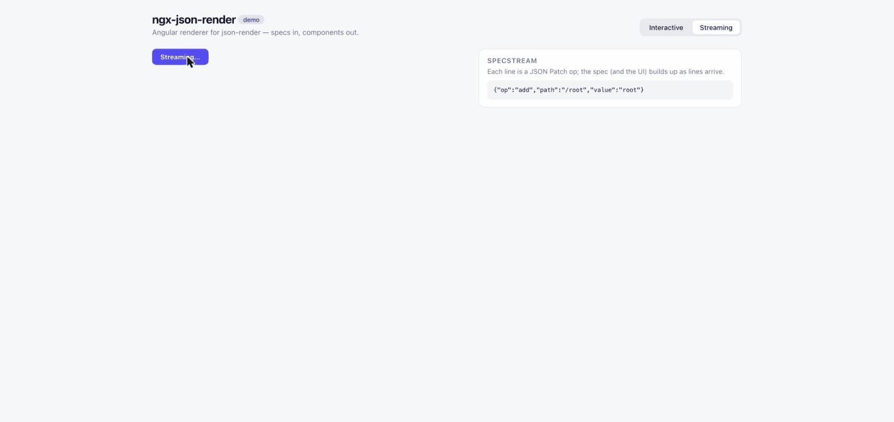

# ngx-json-render (workspace)

[](https://www.npmjs.com/package/ngx-json-render) [](https://github.com/shteynu/ngx-json-render/actions/workflows/ci.yml) [](LICENSE)

Angular renderer for [json-render](https://github.com/vercel-labs/json-render): stream AI-generated JSON specs into real Angular components — signals, standalone components, zoneless-friendly.

**→ Package documentation: [`projects/ngx-json-render/README.md`](projects/ngx-json-render/README.md)**

**→ Live demo: <https://shteynu.github.io/ngx-json-render/>** — interactive spec (bindings, repeat, confirm, watch) and a replayable SpecStream showing progressive rendering — or [](https://stackblitz.com/github/shteynu/ngx-json-render)



## Workspace layout

- [`projects/ngx-json-render`](projects/ngx-json-render) — the renderer (published as `ngx-json-render`).
- [`projects/ngx-json-render-material`](projects/ngx-json-render-material) — a ready-made Angular Material catalog of 28 components (published as `ngx-json-render-material`), so a spec can be generated and rendered without writing a catalog first.
- [`projects/demo`](projects/demo) — demo app: an interactive spec (state bindings, repeat, confirm, watch) and a replayable SpecStream showing progressive rendering.

## Develop

```bash
npm ci
npm start            # build the library, then serve the demo at http://localhost:4200
npm test             # vitest: renderer + Material catalog + demo
npm run build        # build renderer + Material catalog + demo
```

The demo consumes the *built* package (`dist/ngx-json-render`) via a `tsconfig` path mapping — `npm start` builds it first; keep `npm run watch:lib` running alongside if you're editing the library itself. This also makes the repo boot unmodified on StackBlitz, which always runs `npm install && npm start`.

## Releasing

Releases are automated via [npm trusted publishing](https://docs.npmjs.com/trusted-publishers) (OIDC — no tokens, provenance included). The two packages version independently, each on its own tag prefix.

The renderer, in [`release.yml`](.github/workflows/release.yml) — bump `version` in [`projects/ngx-json-render/package.json`](projects/ngx-json-render/package.json), commit, then

```bash
git tag v0.x.y && git push origin main v0.x.y
```

The Material catalog, in [`release-material.yml`](.github/workflows/release-material.yml) — bump `version` in [`projects/ngx-json-render-material/package.json`](projects/ngx-json-render-material/package.json), commit, then

```bash
git tag material-v0.x.y && git push origin main material-v0.x.y
```

The workflow verifies the tag matches the package version, builds, runs the library tests, publishes to npm, and creates the GitHub release. One-time setup on npmjs.com: package **Settings → Trusted publisher → GitHub Actions**, repository `shteynu/ngx-json-render`, workflow `release.yml`.

Manual fallback (requires 2FA OTP):

```bash
npm run build:lib && cp LICENSE dist/ngx-json-render/ && cd dist/ngx-json-render && npm publish
```

The demo is deployed to GitHub Pages by [`ci.yml`](.github/workflows/ci.yml) on every push to `main`.

## Status & upstream

There is no first-party Angular renderer in the json-render monorepo (checked 2026-08-29; community PRs [#244](https://github.com/vercel-labs/json-render/pull/244) and [#310](https://github.com/vercel-labs/json-render/pull/310) were never merged). This library mirrors the baseline renderer contract (React = Vue = Solid = Svelte) and is structured so its `src/lib` can be adapted into a `packages/angular` PR upstream.

## License

Apache-2.0 — matching the upstream json-render project.
