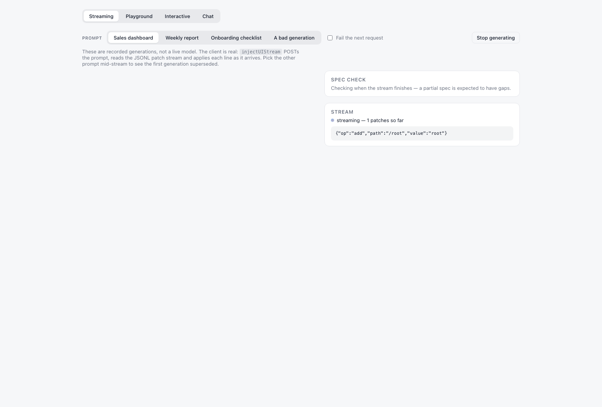

# ngx-json-render (workspace)

[](https://www.npmjs.com/package/ngx-json-render) [](https://github.com/shteynu/ngx-json-render/actions/workflows/ci.yml) [](LICENSE)

Angular renderer for [json-render](https://github.com/vercel-labs/json-render): stream AI-generated JSON specs into real Angular components — signals, standalone components, zoneless (checked in CI: no Zone.js, no `NgZone`, every suite explicitly zoneless).

**→ Package documentation: [`projects/ngx-json-render/README.md`](projects/ngx-json-render/README.md)**

**→ Compared with Hashbrown, the other generative-UI library for Angular: [ngx-json-render or Hashbrown?](projects/ngx-json-render/README.md#ngx-json-render-or-hashbrown)**

**→ Live demo: <https://shteynu.github.io/ngx-json-render/>** — opens on a Q3 sales dashboard (KPI cards, a line chart, a bar chart) streaming in patch by patch; the same tab replays a support form whose validation and submit the model wrote, so sending it empty shows the checks at work. Four tabs: that SpecStream, which you can stop mid-generation and inspect half-built; a playground that renders a spec you edit by hand against either catalog and shows the system prompt a model would receive; an interactive spec (bindings, repeat, confirm, watch); and a chat where prose and UI patches arrive in the same reply. The two streaming tabs replay a recording by default and call a real model if you paste in your own key — or [](https://stackblitz.com/github/shteynu/ngx-json-render)



## Agent skills

One skill per published package for AI coding agents — the same idea as
json-render's own `skills/` directory. The [skills CLI](https://skills.sh)
installs them into Claude Code, Cursor, Codex and the other agents it
supports, and the agent then writes catalogs, components and streaming code
against the real API instead of guessing from the package name:

```bash
npx skills add shteynu/ngx-json-render --skill ngx-json-render --skill ngx-json-render-material
```

In Claude Code they also come as a plugin, which updates with each release:

```bash
claude plugin marketplace add shteynu/ngx-json-render
claude plugin install ngx-json-render@ngx-json-render
```

Sources: [`skills/ngx-json-render/SKILL.md`](skills/ngx-json-render/SKILL.md)
and [`skills/ngx-json-render-material/SKILL.md`](skills/ngx-json-render-material/SKILL.md).
An agent reads the skill instead of the README, so a change to a package's
public API or its README is not done until the matching skill says the same.
CI compiles every TypeScript snippet in both skills against the built
packages (`npm run check:skills`), so a skill cannot silently fall behind.
The plugin in [`plugins/ngx-json-render`](plugins/ngx-json-render) holds
copies of both skills that `npm run sync:plugin` refreshes; CI fails when
they drift (`npm run check:plugin`).

## Workspace layout

- [`projects/ngx-json-render`](projects/ngx-json-render) — the renderer (published as `ngx-json-render`).
- [`projects/ngx-json-render-material`](projects/ngx-json-render-material) — a ready-made Angular Material catalog of 29 components (published as `ngx-json-render-material`), so a spec can be generated and rendered without writing a catalog first.
- [`skills`](skills) — agent skills, one per published package (see below).
- [`projects/mcp-app`](projects/mcp-app) — prototype: the Material catalog as an [MCP App](https://modelcontextprotocol.io/docs/extensions/apps), rendered inline in Claude, ChatGPT, VS Code or Cursor. It uses upstream's `@json-render/mcp` for the server side and adds the Angular view (`injectJsonRenderApp` from `ngx-json-render/mcp`, the counterpart of its React `useJsonRenderApp`); `npm run build:mcp-app`.
- [`projects/demo`](projects/demo) — demo app: a landing with the install line, then four tabs: a SpecStream on `injectUIStream` with a stop button, opening on a recorded sales dashboard with SVG charts; a playground (edit a spec live, switch catalogs, read `catalog.prompt()`); an interactive spec (state bindings, repeat, confirm, watch); and a chat on `injectChatUI` where prose and patches share one stream. Under `ng serve` the Streaming tab also mounts `<json-render-devtools>`; the deployed build never loads it. The two streaming tabs swap only their transport between a recorded generation and a live model, so what you watch is the real client either way; the key is held in `sessionStorage` and goes straight from the browser to the provider.

## Develop

```bash
npm ci
npm start            # build the library, then serve the demo at http://localhost:4200
npm test             # vitest: renderer + Material catalog + demo
npm run build        # build renderer + Material catalog + demo
```

The demo consumes both _built_ packages (`dist/ngx-json-render` and `dist/ngx-json-render-material`, which its playground renders) via `tsconfig` path mappings — `npm start` and `npm test` build them first, so a fresh clone needs no other step. This also makes the repo boot unmodified on StackBlitz, which always runs `npm install && npm start`. Keep `npm run watch:lib` running alongside if you're editing the library itself.

## Releasing

Releases are automated via [npm trusted publishing](https://docs.npmjs.com/trusted-publishers) (OIDC — no tokens, provenance included). The two packages version independently, each on its own tag prefix.

The renderer, in [`release.yml`](.github/workflows/release.yml) — bump `version` in [`projects/ngx-json-render/package.json`](projects/ngx-json-render/package.json), commit, then

```bash
git tag v0.x.y && git push origin main v0.x.y
```

The Material catalog, in [`release-material.yml`](.github/workflows/release-material.yml) — bump `version` in [`projects/ngx-json-render-material/package.json`](projects/ngx-json-render-material/package.json), commit, then

```bash
git tag material-v0.x.y && git push origin main material-v0.x.y
```

Each workflow verifies the tag matches the package version, builds, runs that
project's tests, publishes to npm, and creates the GitHub release.

Both workflows can also be started by hand, for a machine that cannot push
tags: **Actions → Release** (or **Release Material catalog**) → **Run
workflow** on the branch holding the version bump, normally `main`. The
workflow then derives the tag from the manifest (`v<version>` or
`material-v<version>`), creates it on the commit it runs on, and continues
exactly as a tag push would; a tag that already exists on another commit
fails the run instead of publishing, so a forgotten bump cannot ship twice.

One-time setup on npmjs.com, **per package** — configuring one does not cover the
other, and a package with no connection gets no credentials at all in Actions and
fails with `ENEEDAUTH`. Under package **Settings → Trusted Publisher → GitHub
Actions**:

| Field                | Value                                                                                                                          |
| -------------------- | ------------------------------------------------------------------------------------------------------------------------------ |
| Organization or user | `shteynu`                                                                                                                      |
| Repository           | `ngx-json-render`                                                                                                              |
| Workflow filename    | `release.yml` for the renderer, `release-material.yml` for the catalog — filename only, no path                                |
| Environment name     | leave empty — neither workflow declares an `environment:`, and a name here would have to match one                             |
| Allowed actions      | tick `Allow npm publish`; the form will not save without at least one, and `npm stage publish` is not what these workflows run |

Manual fallback (requires 2FA OTP). It publishes without the provenance
attestation the workflows attach, so reach for it only when Actions is
unavailable. Pass `--registry` explicitly: npm reads project config from the
current directory only, so the `registry` line in this repo's `.npmrc` does
**not** apply once you `cd` into `dist/`, and the publish silently targets
whatever your global `~/.npmrc` points at.

```bash
npm run build:lib && cp LICENSE dist/ngx-json-render/ && cd dist/ngx-json-render && npm publish --registry https://registry.npmjs.org/
```

Same for the Material catalog:

```bash
npm run build:material && cp LICENSE dist/ngx-json-render-material/ && cd dist/ngx-json-render-material && npm publish --registry https://registry.npmjs.org/
```

The demo is deployed to GitHub Pages by [`ci.yml`](.github/workflows/ci.yml) on every push to `main`.

## Status & upstream

There is no first-party Angular renderer in the json-render monorepo, and none on npm: 28 other `@json-render/*` packages sit at 0.20.0, but no `@json-render/angular` (checked 2026-08-29). Community PR [#244](https://github.com/vercel-labs/json-render/pull/244) has been open since March 2026 without a maintainer decision; [#310](https://github.com/vercel-labs/json-render/pull/310) came later and was closed by its own author on 2026-08-03. This library mirrors the baseline renderer contract (React = Vue = Solid = Svelte) and is structured so its `src/lib` can be adapted into a `packages/angular` PR upstream.

## License

Apache-2.0 — matching the upstream json-render project.
